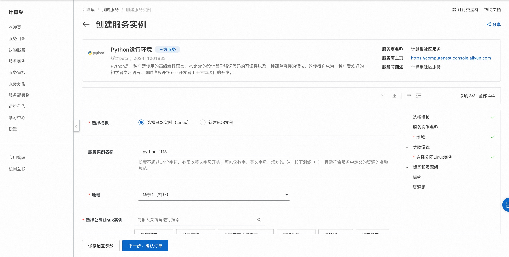
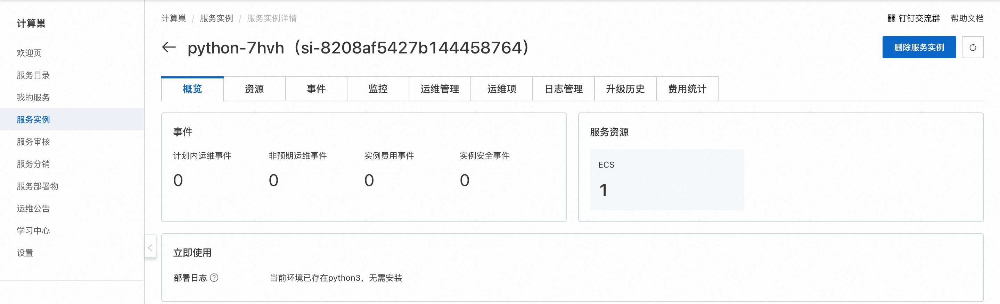
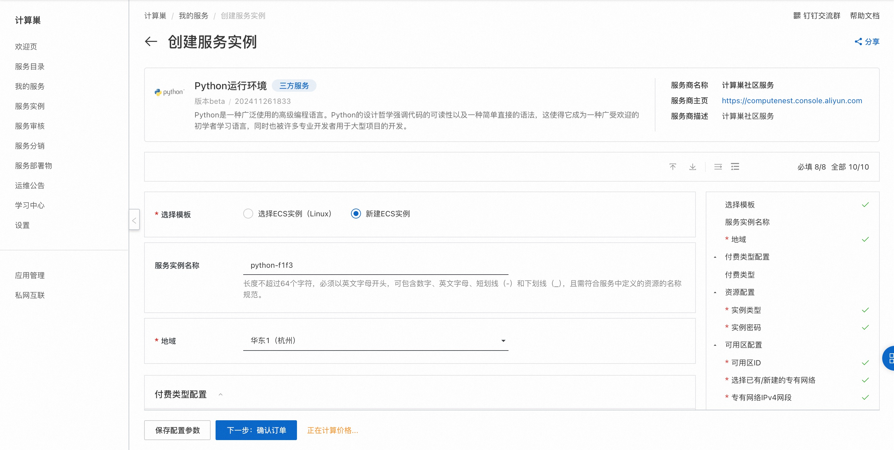
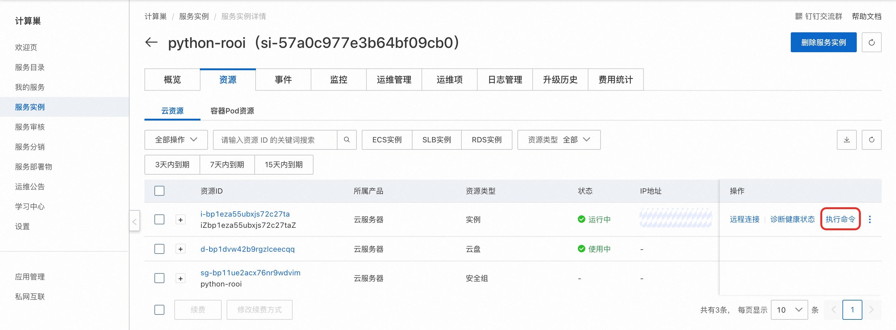
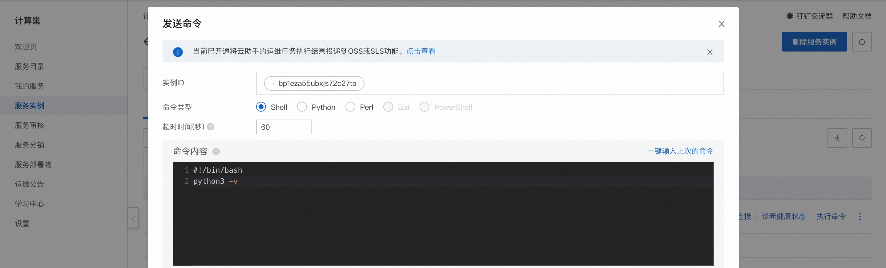

# 快速部署Python运行环境

## 概述

Python是一种广泛使用的高级编程语言。Python的设计哲学强调代码的可读性以及一种简单直接的语法，这使得它成为一种广受欢迎的初学者学习语言，同时也被许多专业开发者用于大型项目的开发。 详情请查看[Python官网](https://www.python.org/)。

本服务支持在已有的ECS实例（Linux）上部署和新建ECS实例（Linux）部署。

## 计费说明

Python运行环境在计算巢上部署的费用主要涉及：

- 所选vCPU与内存规格
- 磁盘容量
- 公网带宽

计费方式：按量付费（小时）

预估费用在创建实例时可实时看到。

## RAM账号所需权限

Python运行环境需要对ECS、VPC等资源进行访问和创建操作，若您使用RAM用户创建服务实例，需要在创建服务实例前，对使用的RAM用户的账号添加相应资源的权限。添加RAM权限的详细操作，请参见[为RAM用户授权](https://help.aliyun.com/document_detail/121945.html)
。所需权限如下表所示。

| 权限策略名称                          | 备注                         |
|---------------------------------|----------------------------|
| AliyunECSFullAccess             | 管理云服务器服务（ECS）的权限           |
| AliyunVPCFullAccess             | 管理专有网络（VPC）的权限             |
| AliyunROSFullAccess             | 管理资源编排服务（ROS）的权限           |
| AliyunComputeNestUserFullAccess | 管理计算巢服务（ComputeNest）的用户侧权限 |
| AliyunCloudMonitorFullAccess    | 管理云监控（CloudMonitor）的权限     |

## 选择ECS实例部署

选择ECS实例部署支持Linux操作系统。

### 前提条件
1. 所选ECS实例可以访问公网
2. 所选ECS实例在运行中，如实例刚启动请稍等片刻
3. 系统兼容性：Alibaba Cloud Linux 3.2104 LTS/CentOS 7.7/CentOS 7.8/CentOS 7.9/Ubuntu 20.04/Ubuntu 22.04

### 操作步骤
1. 单击[部署链接](https://computenest.console.aliyun.com/service/instance/create/default?type=user&ServiceName=Python%E8%BF%90%E8%A1%8C%E7%8E%AF%E5%A2%83)，进入服务实例部署界面。
2. 选择目标ECS实例，点击 下一步：确认订单。
    
3. 点击 立即创建，等待服务实例创建完成。服务实例创建成功后，进入服务实例详情页。在概览页可获取安装日志。 
    


## 新建ECS实例部署

新建ECS实例部署支持Linux操作系统。

### 操作步骤
1. 单击[部署链接](https://computenest.console.aliyun.com/service/instance/create/default?type=user&ServiceName=Python%E8%BF%90%E8%A1%8C%E7%8E%AF%E5%A2%83)，进入服务实例部署界面。
2. 选择新建ECS实例并根据界面提示配置参数，配置完成后点击下一步：确认订单。
    
3. 点击立即创建，等待服务实例创建完成。服务实例创建成功后，进入服务实例资源页。
    
4. 在ECS中执行命令查看Python3安装结果。
    ```shell
    python3 -v
    ```
    